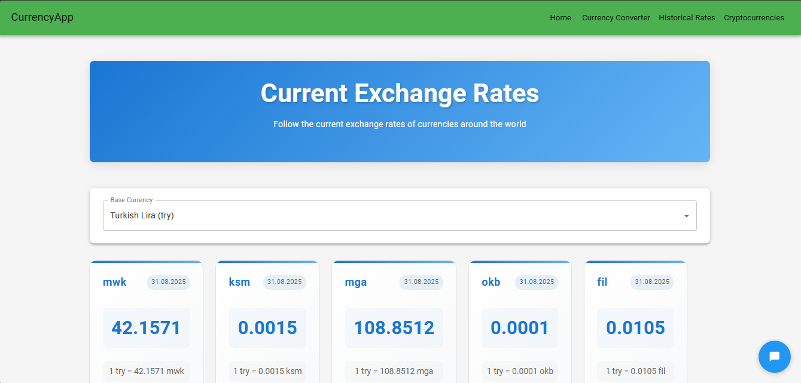
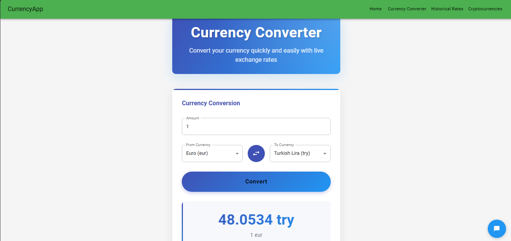
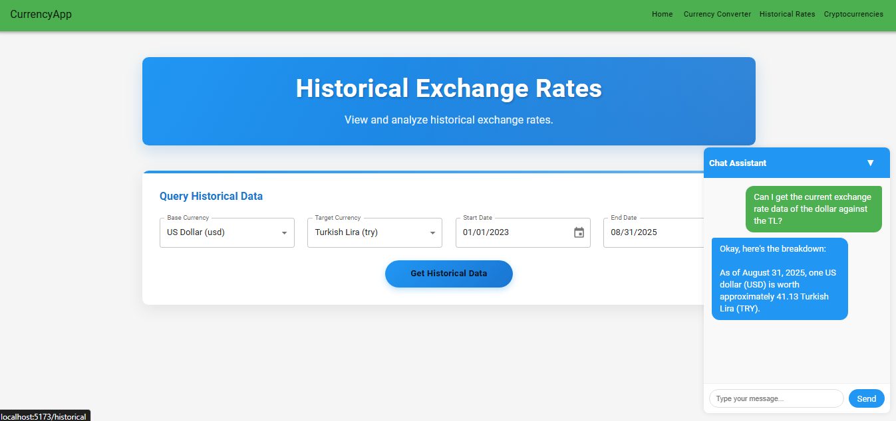
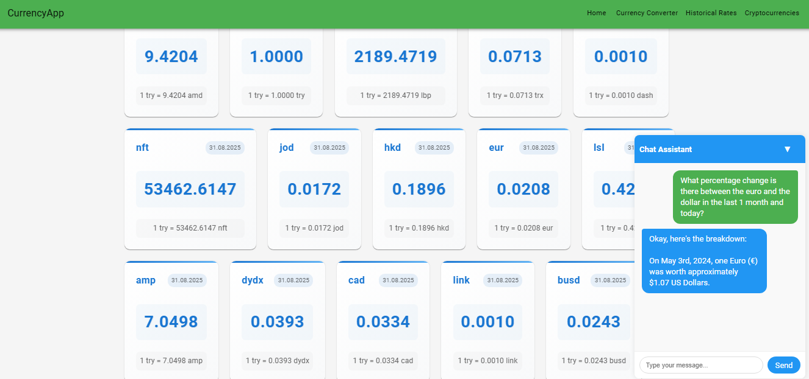
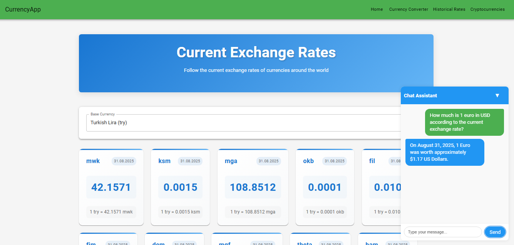
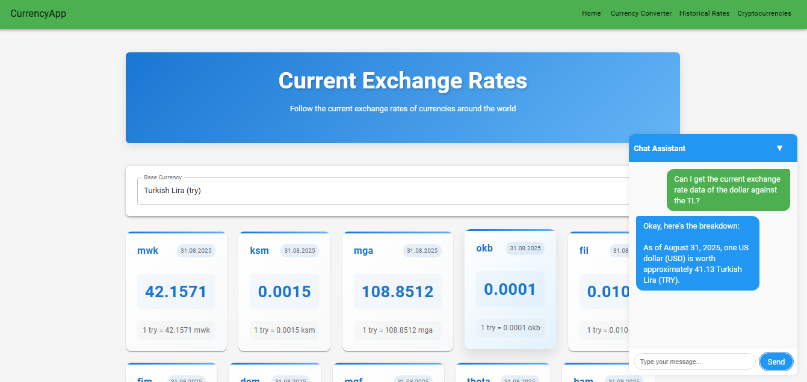

# DovizApp - Currency Exchange and Chat Application

DovizApp is a comprehensive web application that provides real-time and historical currency exchange rates, cryptocurrency rates, and an interactive chat interface to get currency information through natural language.

## ✨ Features

- **Real-time Exchange Rates**: View up-to-date exchange rates for a wide range of currencies.
- **Currency Converter**: Easily convert between different currencies.
- **Historical Data**: Analyze historical exchange rate data with interactive charts.
- **Cryptocurrency Rates**: Track the latest rates for popular cryptocurrencies.
- **AI-Powered Chat**: Ask for currency rates and conversions in plain English and get instant answers.
- **Modern UI**: A clean, responsive, and user-friendly interface built with React and Material-UI.

## 📸 Screenshots

Here's a glimpse of what DovizApp looks like:

### Main Pages
| Current Rates | Converter | Historical Rates |
|---|---|---|
|  |  |  |

### Chat Interface
| Chat Example 1 | Chat Example 2 | Chat Example 3 |
|---|---|---|
|  |  |  |

## 🏗️ Architecture

The application is built with a microservices-oriented architecture, consisting of three main components:

1.  **`DovizServer`**: A Java Spring Boot application that serves as the main backend. It handles fetching data from external APIs, caching, and exposing REST endpoints for the frontend.
2.  **`DovizClient`**: A React single-page application that provides the user interface.
3.  **`DovizMcp`**: A Python-based MCP (Model Context Protocol) server that powers the AI chat functionality, interpreting user queries and fetching data from the `DovizServer`.

---

## 🚀 Modules

### ☕ DovizServer (Backend)

This is the core backend service built with Java and Spring Boot. It's responsible for all business logic related to currency data.

-   **Description**: Exposes a REST API for fetching real-time, historical, and cryptocurrency exchange rates. It integrates with an external API and includes a caching layer to optimize performance.
-   **Technologies**:
    -   Java 17
    -   Spring Boot 3
    -   Spring Web
    -   Spring Cache (Caffeine)
    -   Maven
-   **How to Run**:
    1.  Navigate to the `DovizServer/doviz-api` directory.
    2.  Run the application using the Maven wrapper: `mvnw spring-boot:run`.
    3.  The server will start on `http://localhost:8080`.

### ⚛️ DovizClient (Frontend)

This is the user-facing application built with React.

-   **Description**: Provides a rich, interactive UI for users to view and analyze currency data. It communicates with the `DovizServer` to get the data it displays.
-   **Technologies**:
    -   React 18
    -   Vite
    -   Material-UI (MUI)
    -   Axios
    -   Chart.js
-   **How to Run**:
    1.  Navigate to the `DovizClient/doviz-client` directory.
    2.  Install dependencies: `npm install`.
    3.  Start the development server: `npm run dev`.
    4.  The client will be available at `http://localhost:5173`.

### 🤖 DovizMcp (Chat Server)

This module provides an AI-powered chat interface for interacting with the currency data.

-   **Description**: Uses the Model Context Protocol (MCP) to define tools that an AI model can use. It translates natural language queries (e.g., "how much is 100 dollars in euros?") into API calls to the `DovizServer`.
-   **Technologies**:
    -   Python 3
    -   FastMCP
    -   Loguru, Requests
-   **How to Run**:
    1.  Navigate to the `DovizMcp` directory.
    2.  Set up a virtual environment: `python -m venv .venv` and activate it.
    3.  Install dependencies: `pip install -r requirements.txt`.
    4.  Run the server: `python chat_server_api.py`.
    5.  The MCP server will be ready to accept connections from a compatible chat client.

## 🛠️ Full Project Setup

To run the entire application suite:

1.  **Start the Backend**: Follow the steps to run `DovizServer`.
2.  **Start the Frontend**: Follow the steps to run `DovizClient`.
3.  **Start the Chat Server**: Follow the steps to run `DovizMcp`.

Once all services are running, you can open your browser to the `DovizClient` URL (`http://localhost:5173`) to use the application.
